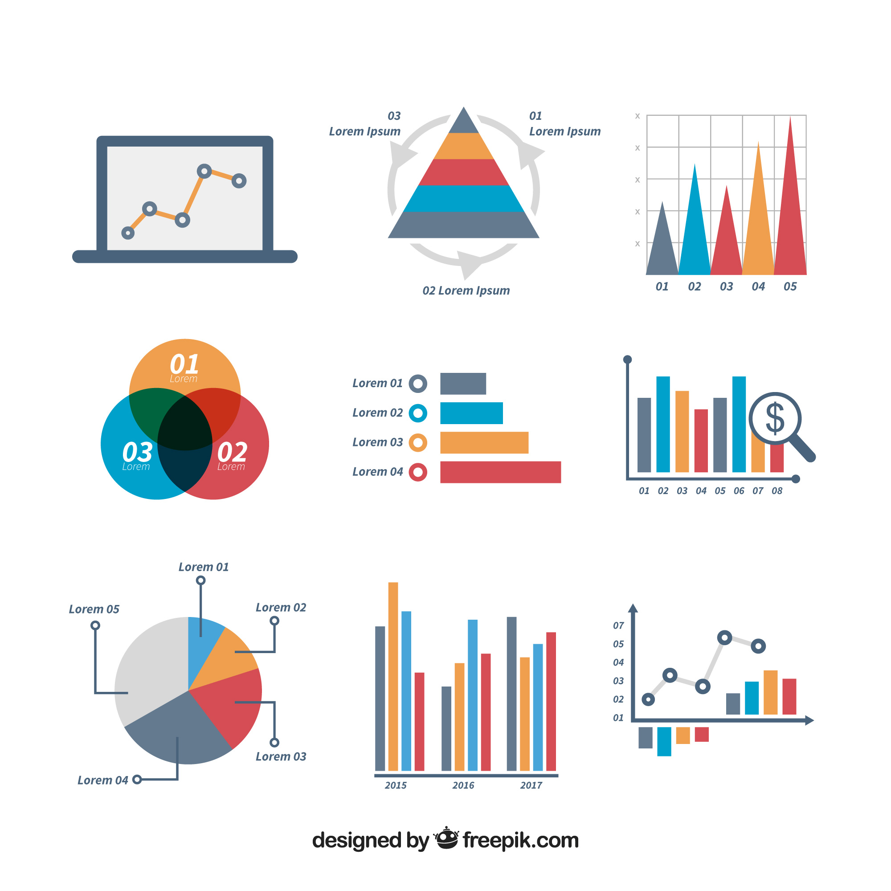

```{r, include=FALSE}
knitr::opts_chunk$set(
  results='asis', 
  echo = FALSE
)
library(tidyverse)
library(glue)

# Set this to true to have links turned into footnotes at the end of the document
PDF_EXPORT <- FALSE

# Holds all the links that were inserted for placement at the end
links <- c()

source('parsing_functions.R')


# First let's get the data, filtering to only the items tagged as
# Resume items
position_data <- read_csv('positions.csv') %>% 
  filter(in_resume) %>% 
  mutate(
    # Build some custom sections by collapsing others
    section = case_when(
      section %in% c('industry_positions', 'teaching_positions') ~ 'positions', 
      section %in% c('data_science_writings', 'by_me_press') ~ 'writings',
      section %in% c('conference_presentations', 'certifications', 'fill') ~ 'other',
      TRUE ~ section
    )
  ) 

```


Aside
================================================================================


{width=100%}

Contact {#contact}
--------------------------------------------------------------------------------


- <i class="fa fa-envelope"></i> bjjefferies@gmail.com
- <i class="fa fa-github"></i> github.com/bjjefferies
- <i class="fa fa-link"></i> [bjjefferies.io](https://bjjefferies.github.io/)
- <i class="fa fa-phone"></i> (913) 680-8128


Language Skills {#skills}
--------------------------------------------------------------------------------


```{r}
skills <- tribble(
  ~skill,               ~level,
  "R",                  3,
  "SQL",                2,
  "Python",             2,                
  "Spanish",            4
)
build_skill_bars(skills)
```


Open Source Contributions {#open-source}
--------------------------------------------------------------------------------

All projects available at github.com/bjjefferies/


More info {#more-info}
--------------------------------------------------------------------------------

Check out my [webpage](https://bjjefferies.github.io/) for a view of some of my data projects.


Disclaimer {#disclaimer}
--------------------------------------------------------------------------------

Made w/ [**pagedown**](https://github.com/rstudio/pagedown). 

Source code: [github.com/bjjefferies/cv_lab](https://github.com/bjjefferies/cv_lab).

Last updated on `r Sys.Date()`.


Main
================================================================================

Ben Jefferies {#title}
--------------------------------------------------------------------------------

```{r}
intro_text <- "I am a seasoned educator with experience in K-12 and higher education teaching mathematics. I currently train math tutors at Northern Arizona University and am getting a M.S. in Program Evaluation and Data Analytics at ASU. I am looking for positions that allow me to utilize my domain experpertise as a data analyst."


cat(sanitize_links(intro_text))
```


Education {data-icon=graduation-cap data-concise=true}
--------------------------------------------------------------------------------

```{r}
position_data %>% print_section("education")
```


Selected Positions {data-icon=suitcase}
--------------------------------------------------------------------------------

```{r}
position_data %>% print_section('positions')
```


Other Achievements {data-icon=magnifying-glass-chart}
--------------------------------------------------------------------------------

```{r}
position_data %>% print_section('other')
```

